# Github Programing Language Statistics

Statistics on the number of new project by programming language according to Github search

Automatic update via Github Action

## Programming Language 使用趋势


## 新增项目(Programming Language)分布图


## 年度新增项目(Programming Language)分布图


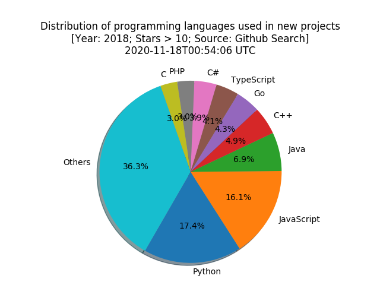

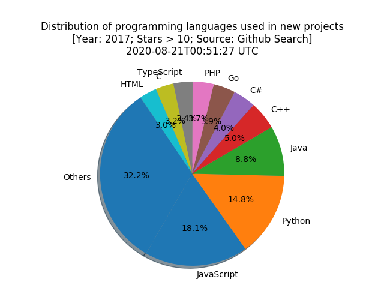

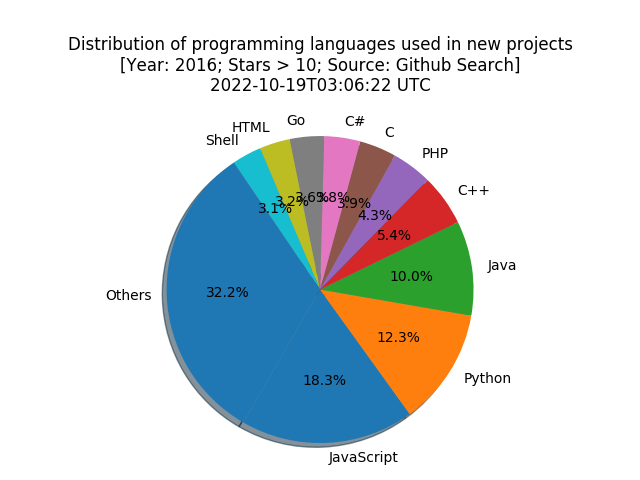

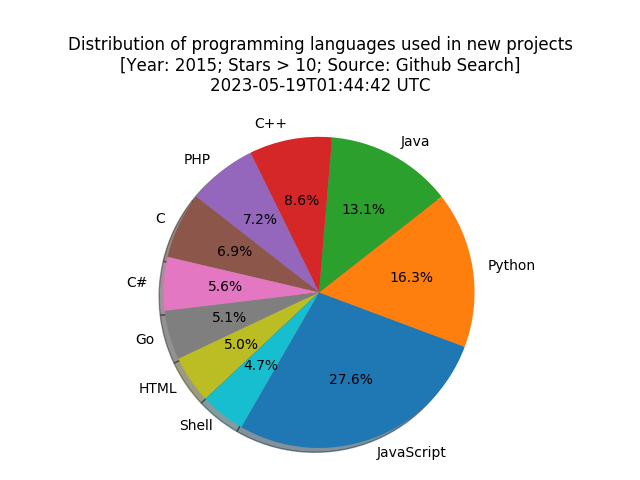

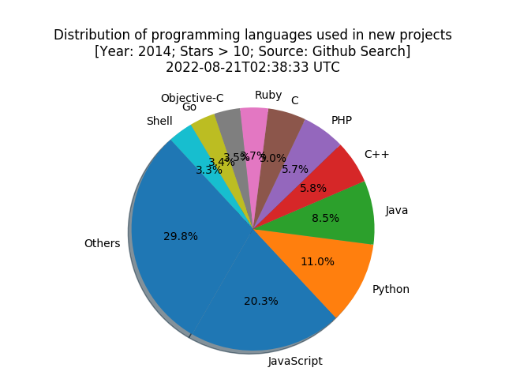

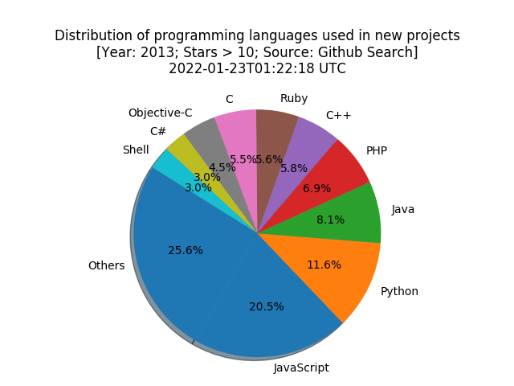

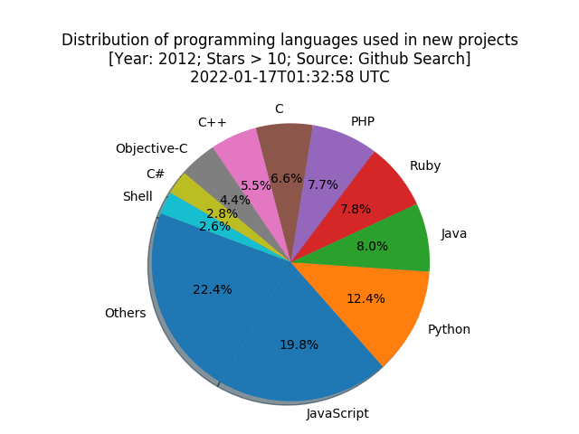

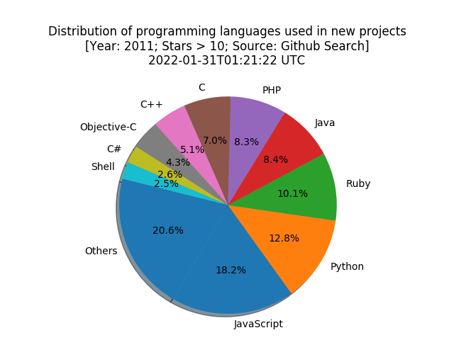

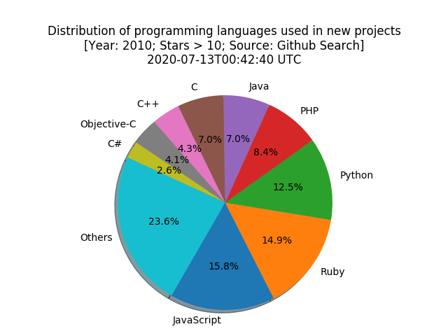

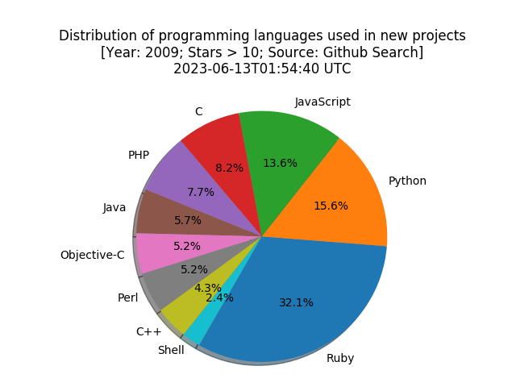

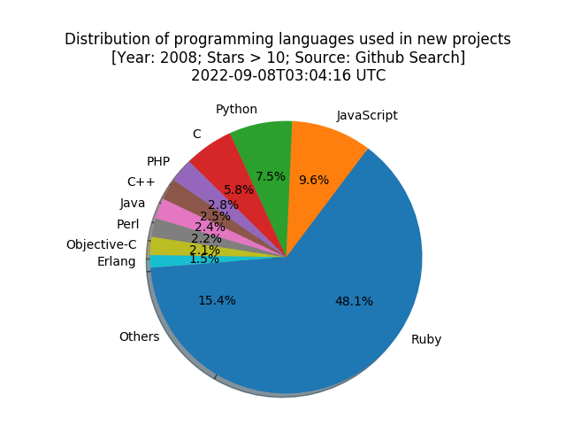

## Usage

```python
python pls.py
```

Statistics on the number of new project by programming language according to Github search

Automatic update via Github Action

## 主流编程语言新增项目走势图


## 新增项目编程语言柱状图


## 新增项目编程语言分布图


## Usage

```python
python pls.py
```
