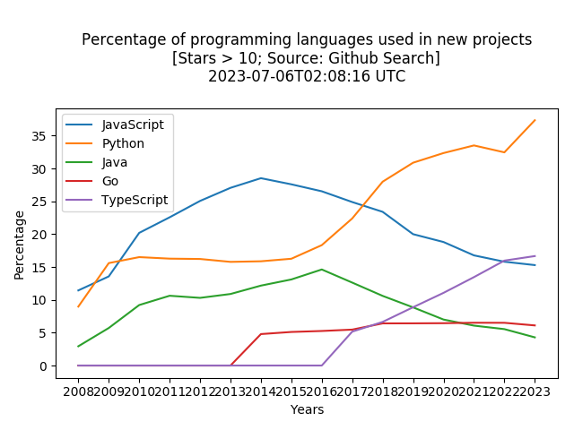
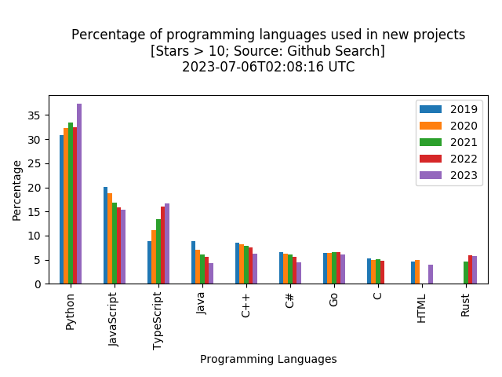
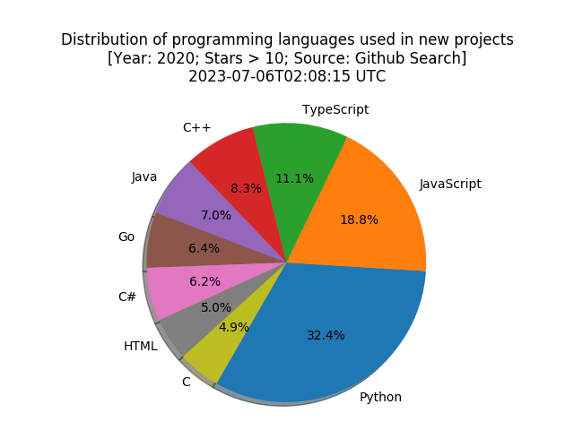
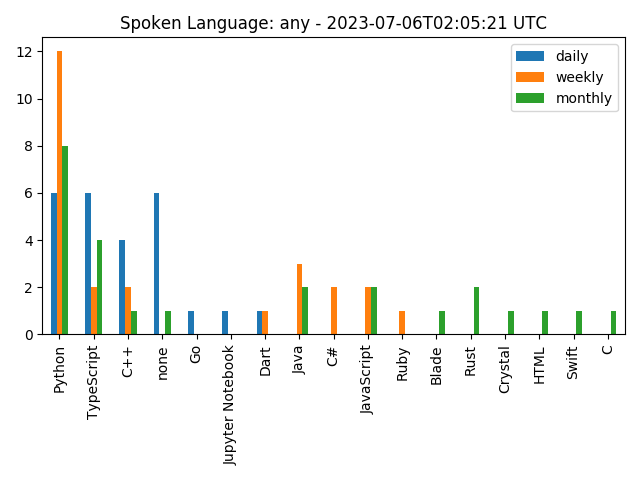
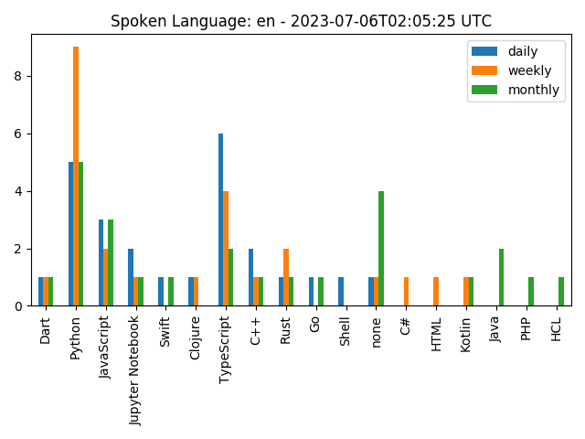

# Github Programing Language Statistics

Statistics of programming languages used in the Github projects

> Automatic update via Github Action

## Usage

- New Project Statistics: `python npps.py`
- Trending Project Statistics: `python tpps.py`

## New Project (Programming Languages) Statistics

### Percentage of programming languages used in new projects

#### Line

#### Bar

## Distribution of programming languages used in new projects every year

### 2020

### 2019

[**All Years**](./years.md)

## Trending Project (Programming Languages) Statistics

### Spoken Language: Any

### Spoken Language: EN

### Spoken Language: CN

